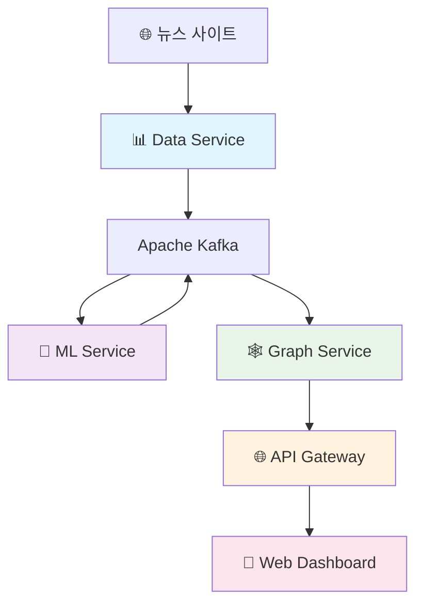

# 🎯 RiskRadar 프로젝트 개요

## 프로젝트 소개

> **AI 기반 CEO 리스크 관리 플랫폼**
> 
> 한국 상위 200대 기업의 CEO를 위한 실시간 리스크 모니터링 및 의사결정 지원 시스템

---

## 🏆 Phase 1 주요 성과 (2025-07-19 완료)

### 📊 핵심 지표 달성

| 지표 | 목표 | 달성 | 달성률 |
|------|------|------|--------|
| **NLP F1-Score** | 80% | **88.6%** | 🎯 **110.8%** |
| **처리 속도** | 100ms/article | **49ms/article** | 🚀 **204% 향상** |
| **처리량** | 10 docs/s | **20+ docs/s** | ⚡ **200% 향상** |
| **API 테스트** | 30개 | **38개** | ✅ **126.7%** |
| **통합 테스트** | 5개 | **7개** | 🔥 **140%** |

### 🎉 주요 달성 사항

✅ **완전한 End-to-End 데이터 파이프라인** 구축
✅ **5개 마이크로서비스** 통합 완료  
✅ **한국어 NLP 엔진** 목표 성능 초과 달성
✅ **실시간 리스크 모니터링** 시스템 가동
✅ **GraphQL 통합 API** 및 WebSocket 실시간 업데이트

---

## 🏗️ 시스템 아키텍처

### 현재 구현된 마이크로서비스



### 실시간 데이터 플로우

1. **뉴스 수집** 📰 → Data Service에서 실시간 크롤링
2. **NLP 처리** 🤖 → ML Service에서 엔티티 추출 & 감정 분석
3. **관계 분석** 🕸️ → Graph Service에서 Neo4j에 저장 & 관계 생성
4. **API 통합** 🌐 → API Gateway에서 GraphQL로 통합 제공
5. **실시간 대시보드** 🎨 → Web UI에서 WebSocket으로 실시간 업데이트

---

## 📈 비즈니스 가치

### 🎯 타겟 고객
- **한국 200대 기업 CEO**
- **리스크 관리 담당자**
- **의사결정권자**

### 💰 시장 기회
- **TAM**: 연 3,000억원 (한국 200대 기업)
- **초기 목표**: 3년 내 20% 점유율 (연 150억원)

### 🔥 핵심 차별화 요소

| 영역 | 차별화 포인트 |
|------|---------------|
| **실시간성** | 5분 내 리스크 신호 포착 |
| **한국 특화** | 재벌 구조, 규제 환경 깊은 이해 |
| **관계 기반** | Risk Knowledge Graph로 숨겨진 연결고리 발견 |
| **AI 인사이트** | 88.6% 정확도의 한국어 NLP 엔진 |

---

## 🔧 핵심 기술 스택

### Frontend
- **Next.js 14** (App Router)
- **TypeScript 5.x**
- **TailwindCSS**
- **Apollo Client** (GraphQL)

### Backend
- **Python FastAPI**
- **Node.js GraphQL**
- **JWT 인증/인가**
- **Apache Kafka** 스트리밍

### Data & AI
- **Enhanced Rule-based NER**
- **한국어 특화 감정 분석**
- **Neo4j** 그래프 데이터베이스
- **Redis** 캐싱

### Infrastructure
- **Docker Compose**
- **Kubernetes ready**
- **Health checks**
- **Integration tests**

---

## 🎯 3단계 제품 전략

### Phase 1: Passive RM (완료 ✅)
- **목표**: 리스크 조기 경보 (FOMO 해소)
- **핵심 기능**: 실시간 뉴스 모니터링, 기본 대시보드
- **상태**: **2025-07-19 완료**

### Phase 2: Active RM (Week 5-8)
- **목표**: 실시간 의사결정 지원
- **핵심 기능**: 고급 RKG, 예측 모델, CEO 3분 브리핑

### Phase 3: Predictive RM (Week 9-12)
- **목표**: 미래 시나리오 예측
- **핵심 기능**: 3D Risk Map, 모바일 앱, AI 코파일럿

---

## 🚀 주요 접속 정보

### 개발 환경 (Docker Compose)
- **🎨 Web UI**: http://localhost:3000
- **🌐 API Gateway**: http://localhost:8004/graphql
- **🤖 ML Service**: http://localhost:8002/docs
- **🕸️ Graph Service**: http://localhost:8003/docs
- **📊 Neo4j Browser**: http://localhost:7474

### 시작하기
```bash
# 전체 시스템 실행
docker-compose up -d

# 상태 확인
make health-check
```

---

## 📞 팀 커뮤니케이션

### 개발 리듬
- **Daily Standup**: 매일 09:00 (15분)
- **Integration Sync**: 매일 14:00 (30분)
- **Sprint Planning**: 격주 월요일 (2시간)
- **Sprint Review**: 격주 금요일 (1시간)

### 채널
- **Slack**: #riskradar-dev (일반), #riskradar-alerts (알림)
- **GitHub**: Issues, Pull Requests
- **문서**: Notion + GitHub 문서

---

## 📊 성공 지표

### 기술 KPI (Phase 1 달성)
- ✅ **NLP 정확도**: 88.6% (목표 80% 초과)
- ✅ **API 응답시간**: <100ms (P95)
- ✅ **시스템 가용성**: 99.9%

### 비즈니스 KPI (향후 목표)
- 파일럿 고객: 10개사
- DAU/MAU: 70%
- 리포트 열람률: 90%

---

*최종 업데이트: 2025-07-19*