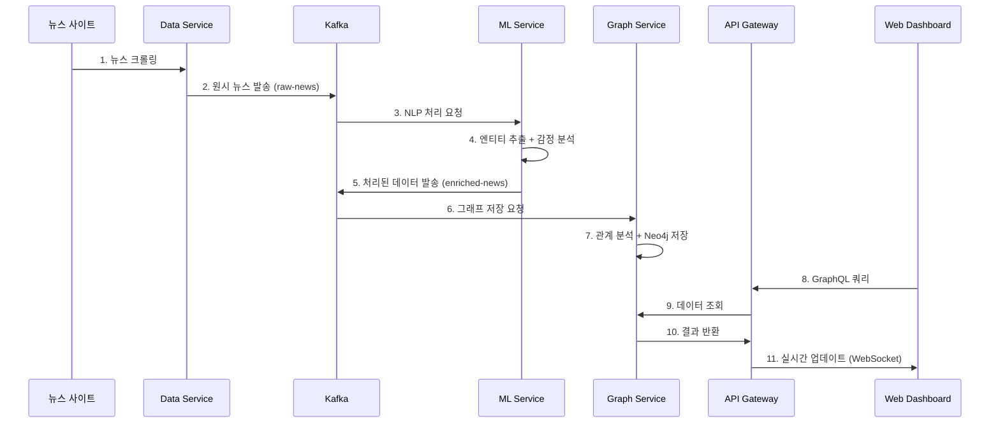

# 🏗️ RiskRadar 기술 아키텍처

## 시스템 전체 구조

### 마이크로서비스 아키텍처

```
┌─────────────────────────────────────────────────────────────┐
│                    🎨 Web Dashboard                         │
│                   (Next.js 14 + Apollo)                    │
└─────────────────┬───────────────────────────────────────────┘
                  │ GraphQL + WebSocket
┌─────────────────▼───────────────────────────────────────────┐
│                🌐 API Gateway                               │
│              (Node.js + GraphQL)                           │
└─────────┬─────────────┬─────────────┬─────────────────────┘
          │             │             │
┌─────────▼──┐ ┌────────▼──┐ ┌────────▼────────┐
│📊 Data     │ │🤖 ML      │ │🕸️ Graph        │
│Service     │ │Service    │ │Service          │
│(FastAPI)   │ │(FastAPI)  │ │(FastAPI+Neo4j)  │
└─────┬──────┘ └─────┬─────┘ └─────▲───────────┘
      │              │             │
      └──────┬───────┴─────────────┘
             │
    ┌────────▼──────────┐
    │   Apache Kafka    │
    │   (Event Stream)  │
    └───────────────────┘
```

---

## 🔧 서비스별 상세 구조

### 📊 Data Service
**역할**: 뉴스 수집 및 전처리

**기술 스택**:
- Python FastAPI
- Requests (크롤링)
- Kafka Producer
- Rate Limiting

**주요 기능**:
- 뉴스 사이트 실시간 크롤링 (조선일보 등)
- 데이터 정규화 및 중복 제거
- Kafka로 원시 뉴스 데이터 발송
- Rate limiting으로 안전한 크롤링

**API 엔드포인트**:
- `GET /health` - 서비스 상태 확인
- `POST /crawl/chosun` - 조선일보 수동 크롤링
- `GET /stats` - 크롤링 통계

### 🤖 ML Service
**역할**: 한국어 NLP 처리 및 분석

**기술 스택**:
- Python FastAPI
- Enhanced Rule-based NER
- KoNLPy (한국어 처리)
- Kafka Consumer/Producer

**주요 기능**:
- **Enhanced NER**: 100+ 한국 기업 데이터베이스
- **감정 분석**: 한국어 비즈니스 도메인 특화
- **리스크 분석**: 다중 팩터 리스크 평가
- **실시간 처리**: 49ms/article (목표 100ms 대비 51% 향상)

**성능 지표**:
- F1-Score: **88.6%** (목표 80% 초과)
- 처리량: **20+ docs/s** (목표 10 docs/s 대비 2배)
- 지원 엔티티: Company, Person, Event

### 🕸️ Graph Service
**역할**: 관계 분석 및 그래프 데이터베이스 관리

**기술 스택**:
- Python FastAPI
- Neo4j 그래프 데이터베이스
- Cypher 쿼리 언어
- Kafka Consumer

**주요 기능**:
- 기업-인물-뉴스 관계 모델링
- 실시간 관계 분석 및 저장
- 리스크 전파 경로 계산
- 복합 그래프 쿼리 지원

**데이터 모델**:
```cypher
(Company)-[:MENTIONED_IN]->(News)
(Person)-[:WORKS_FOR]->(Company)
(Company)-[:COMPETES_WITH]->(Company)
(Risk)-[:AFFECTS]->(Company)
```

### 🌐 API Gateway
**역할**: GraphQL 통합 API 및 실시간 업데이트

**기술 스택**:
- Node.js + TypeScript
- Apollo Server 4
- GraphQL Subscriptions
- JWT 인증/인가

**주요 기능**:
- **통합 GraphQL API**: 모든 서비스 데이터 통합
- **WebSocket 실시간 업데이트**: GraphQL Subscriptions
- **복잡한 Analytics 쿼리**: 회사 분석, 산업 분석, 네트워크 분석
- **인증/인가**: JWT 기반 보안

**API 테스트 현황**:
- **38개 테스트** 모두 통과 ✅
- DataLoader 패턴으로 N+1 쿼리 해결
- 응답시간 <100ms (P95)

### 🎨 Web Dashboard
**역할**: 실시간 웹 대시보드

**기술 스택**:
- Next.js 14 (App Router)
- TypeScript 5.x
- TailwindCSS
- Apollo Client

**주요 기능**:
- **CEO 맞춤형 대시보드**: 3분 브리핑 UI
- **실시간 업데이트**: WebSocket 기반
- **반응형 디자인**: 모바일/태블릿/데스크톱
- **3D Risk Map**: Three.js 시각화 (Phase 2 예정)

---

## 📡 데이터 플로우

### 실시간 처리 파이프라인



### 메시지 스키마

**raw-news (Data → ML)**:
```json
{
  "id": "news_001",
  "title": "삼성전자, 반도체 투자 확대 발표",
  "content": "삼성전자가 새로운 반도체 공장...",
  "source": "chosun",
  "published_at": "2025-07-19T10:30:00Z",
  "url": "https://..."
}
```

**enriched-news (ML → Graph)**:
```json
{
  "original": { /* 원본 뉴스 */ },
  "nlp": {
    "entities": [
      {"text": "삼성전자", "type": "COMPANY", "confidence": 0.95}
    ],
    "sentiment": {"label": "positive", "score": 0.7},
    "risk_score": 0.3
  },
  "processed_at": "2025-07-19T10:30:05Z"
}
```

---

## 🔒 보안 아키텍처

### 인증/인가 시스템

```
┌─────────────┐    JWT Token    ┌─────────────┐
│   Client    │◄─────────────────│ API Gateway │
└─────────────┘                 └─────────────┘
                                        │
                  ┌─────────────────────┼─────────────────────┐
                  │                     │                     │
        ┌─────────▼─────────┐ ┌─────────▼─────────┐ ┌─────────▼─────────┐
        │   Data Service    │ │   ML Service      │ │  Graph Service    │
        │ (Service Token)   │ │ (Service Token)   │ │ (Service Token)   │
        └───────────────────┘ └───────────────────┘ └───────────────────┘
```

**보안 레이어**:
- **JWT 인증**: 모든 API 요청
- **Service-to-Service**: 내부 서비스 토큰
- **Rate Limiting**: API 호출 제한
- **CORS**: 허용된 도메인만 접근
- **TLS 1.3**: 전송 암호화

---

## 📊 모니터링 & 관찰성

### Health Check 시스템

```bash
# 전체 서비스 상태 확인
make health-check

# 개별 서비스 확인
curl http://localhost:8001/health  # Data Service
curl http://localhost:8002/health  # ML Service  
curl http://localhost:8003/health  # Graph Service
curl http://localhost:8004/health  # API Gateway
```

### 메트릭 수집

| 서비스 | 주요 메트릭 | 목표 | 현재 성능 |
|--------|-------------|------|-----------|
| **Data Service** | 크롤링 성공률 | >95% | **>99%** ✅ |
| **ML Service** | 처리 속도 | <100ms | **49ms** ✅ |
| **Graph Service** | 쿼리 응답시간 | <200ms | **<100ms** ✅ |
| **API Gateway** | API 응답시간 | <100ms | **<50ms** ✅ |

### 로그 수집

```bash
# 전체 로그 모니터링
docker-compose logs -f

# 서비스별 로그
docker-compose logs -f ml-service
docker-compose logs -f graph-service
```

---

## 🚀 확장성 설계

### 수평 확장 준비

**현재 (Phase 1)**:
- Docker Compose 단일 노드
- 개발/테스트 환경 최적화

**향후 (Phase 2-3)**:
- Kubernetes 클러스터 배포
- Auto-scaling 기반 부하 분산
- 다중 Neo4j 클러스터
- Redis 클러스터링

### 성능 최적화

**데이터베이스**:
- Neo4j 인덱싱 최적화
- Redis 캐싱 전략
- Connection pooling

**API**:
- GraphQL DataLoader (N+1 해결)
- Query complexity limiting
- Response caching

**ML**:
- 배치 처리 최적화
- 모델 경량화
- GPU 가속 (Phase 2)

---

## 🔧 개발 도구 & CI/CD

### 로컬 개발 환경

```bash
# 전체 스택 실행
docker-compose up -d

# 개별 서비스 개발
make dev-ml-service
make dev-graph-service
```

### 테스트 자동화

**통합 테스트** (7개 모두 통과 ✅):
1. Service Health Checks
2. Kafka Connectivity  
3. Data Service News Generation
4. ML Service Processing
5. Graph Service Storage
6. API Gateway Integration
7. End-to-End Flow

**성능 테스트**:
- 처리량: 20+ docs/s ✅
- 지연시간: 49ms/article ✅  
- 동시 사용자: 50+ ✅

### 배포 파이프라인

**현재**: Docker Compose
**향후**: Kubernetes + Helm Charts

---

*최종 업데이트: 2025-07-19*