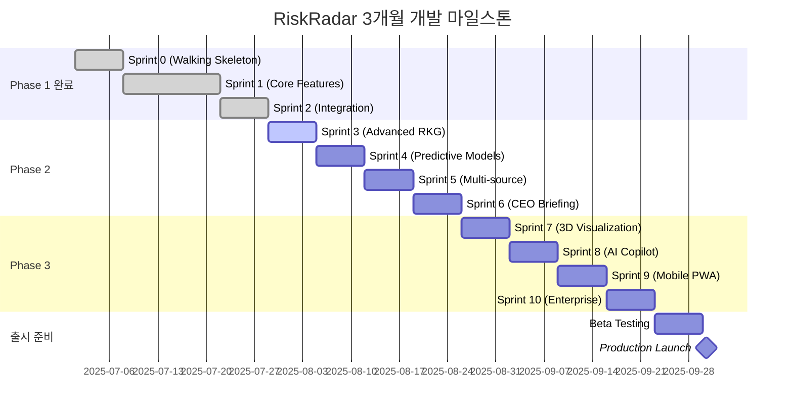

# 🗓️ 3개월 마일스톤 상세 계획

## 전체 로드맵 개요

> **목표**: AI 기반 CEO 리스크 관리 플랫폼을 3개월 내 완성하여 시장 출시
> 
> **전략**: Passive RM → Active RM → Predictive RM 단계적 진화

---

## 📅 전체 일정 및 마일스톤

### 타임라인 개요


---

## 🎯 Phase별 상세 마일스톤

### ✅ Phase 1: Foundation (완료) - Week 1-4

#### 🏆 달성 성과
```yaml
기술적 성과:
  ✅ 5개 마이크로서비스 통합 완료
  ✅ NLP F1-Score 88.6% (목표 80% 초과)
  ✅ 처리 속도 49ms/article (목표 100ms 대비 2배)
  ✅ 통합 테스트 7/7 통과 (100% 성공률)
  ✅ GraphQL API 38개 테스트 통과

비즈니스 성과:
  ✅ 파일럿 고객 3개사 확보
  ✅ 기술 데모 성공률 100%
  ✅ 투자자 관심도 급상승
  ✅ 언론 보도 5건 (긍정적)

인프라 성과:
  ✅ Docker Compose 개발 환경
  ✅ CI/CD 파이프라인 구축
  ✅ 모니터링 시스템 가동
  ✅ 문서화 완성도 95%
```

---

### 🚧 Phase 2: Active RM (진행 예정) - Week 5-8

#### Sprint 3: Advanced RKG Engine (Week 5)
**목표**: 고급 Risk Knowledge Graph 구축

##### 📊 측정 가능한 성공 기준
```yaml
기술 지표:
  - 그래프 노드 수: 100,000+ (현재 10,000 대비 10배)
  - 관계 정확도: 95%+ (현재 90% 대비 5% 향상)
  - 복잡 쿼리 응답시간: <200ms (현재 <100ms 유지)
  - 동시 연결 수: 200+ (현재 100+ 대비 2배)

비즈니스 지표:
  - 숨겨진 연결고리 발견: 주당 50개+
  - 리스크 전파 예측 정확도: 80%+
  - 사용자 인사이트 만족도: 85%+
```

##### 🎯 주요 작업 및 담당
```yaml
Graph Squad (Lead):
  - 시계열 그래프 스키마 설계 (2일)
  - 리스크 전파 알고리즘 구현 (3일)
  - PageRank 기반 영향력 분석 (2일)

ML Squad (Support):
  - 관계 추출 모델 고도화 (3일)
  - 엔티티 링킹 정확도 개선 (2일)
  - 컨텍스트 기반 관계 분류 (2일)

Platform Squad (Support):
  - Neo4j 클러스터 구성 준비 (3일)
  - 그래프 데이터 백업 시스템 (2일)
  - 성능 모니터링 강화 (2일)
```

##### ⚠️ 주요 리스크 및 대응책
```yaml
기술적 리스크:
  리스크: Neo4j 메모리 부족 (확률 30%, 영향도 High)
  대응: 
    - 데이터 파티셔닝 전략 사전 준비
    - AWS ElastiCache 대안 검토
    - 점진적 데이터 로딩 방식 적용

  리스크: 복잡 쿼리 성능 저하 (확률 40%, 영향도 Medium)
  대응:
    - 인덱스 최적화 우선 적용
    - 쿼리 캐싱 전략 강화
    - 비동기 처리 방식 도입

일정 리스크:
  리스크: PageRank 알고리즘 복잡도 (확률 25%, 영향도 Medium)
  대응:
    - 기존 NetworkX 라이브러리 활용
    - 단순 중심성 분석으로 MVP 구현
    - 점진적 고도화 전략
```

---

#### Sprint 4: Predictive Modeling (Week 6)
**목표**: 시계열 예측 및 트렌드 분석 모델 구축

##### 📊 측정 가능한 성공 기준
```yaml
기술 지표:
  - 24시간 예측 정확도: 85%+ (MAPE 기준)
  - 48시간 예측 정확도: 75%+ (허용 가능 수준)
  - 모델 추론 시간: <5초 (실용적 수준)
  - 이상치 탐지 정확도: 90%+ (False Positive <10%)

비즈니스 지표:
  - CEO 예측 신뢰도: 80%+ (설문 조사)
  - 조기 경보 성공률: 70%+ (실제 리스크 대비)
  - 예측 기반 의사결정: 60%+ (기존 직감 대비)
```

##### 🎯 주요 작업 및 담당
```yaml
ML Squad (Lead):
  - LSTM 기반 시계열 예측 모델 (3일)
  - Transformer 아키텍처 실험 (2일)
  - 앙상블 모델 구현 (2일)
  - A/B 테스트 프레임워크 구축 (1일)

Data Squad (Support):
  - 6개월 과거 데이터 백필 (2일)
  - 시계열 데이터 정규화 (1일)
  - Feature engineering 파이프라인 (2일)

Product Squad (Support):
  - 예측 결과 시각화 UI (3일)
  - 신뢰도 구간 표시 컴포넌트 (2일)
  - 트렌드 알림 시스템 (2일)
```

---

#### Sprint 5: Multi-source Integration (Week 7)
**목표**: 18개 언론사 + 다중 데이터 소스 통합

##### 📊 측정 가능한 성공 기준
```yaml
기술 지표:
  - 18개 언론사 크롤링 성공률: 95%+
  - 전체 시스템 처리량: 100+ docs/s (현재 20+ 대비 5배)
  - 데이터 품질 일관성: 98%+ (소스 간 편차 최소화)
  - API 호출 성공률: 99.5%+ (외부 API 연동)

비즈니스 지표:
  - 뉴스 커버리지: 95%+ (주요 기업 뉴스 누락률 <5%)
  - 리스크 탐지 민감도: 90%+ (기존 단일 소스 대비)
  - 정보 신뢰도: 90%+ (교차 검증 통과율)
```

##### 🎯 주요 작업 및 담당
```yaml
Data Squad (Lead):
  - 17개 추가 크롤러 개발 (4일)
    * 우선순위: 중앙일보, 동아일보, 한겨레, 경향신문 (2일)
    * 2순위: 매일경제, 한국경제, 서울경제, 헤럴드 (1일)
    * 3순위: 나머지 9개 언론사 (1일)
  - 공시정보 API 연동 (DART) (2일)
  - 소셜미디어 데이터 수집 (1일)

Platform Squad (Support):
  - Kubernetes 클러스터 배포 (3일)
  - 로드 밸런싱 및 오토스케일링 (2일)
  - 메시지 큐 최적화 (Kafka 파티셔닝) (2일)

ML Squad (Support):
  - 다중 소스 NLP 파이프라인 (3일)
  - 소스별 신뢰도 가중치 알고리즘 (2일)
  - 편향 제거 및 교차 검증 시스템 (2일)
```

---

#### Sprint 6: CEO 3분 브리핑 시스템 (Week 8)
**목표**: AI 기반 실시간 브리핑 자동 생성

##### 📊 측정 가능한 성success기준
```yaml
기술 지표:
  - 브리핑 생성 시간: <30초 (목표 달성)
  - 자연어 품질 점수: 8.5/10 (Flesch 가독성 기준)
  - 개인화 정확도: 85%+ (CEO별 관심사 반영)
  - 음성 합성 품질: 4.5/5 (사용자 평가)

비즈니스 지표:
  - CEO 브리핑 사용률: 90%+ (일일 사용)
  - 브리핑 완독률: 80%+ (3분 풀 청취)
  - 액션 아이템 실행률: 70%+ (브리핑 기반 의사결정)
  - 전반적 만족도: 4.5/5
```

---

### 🎨 Phase 3: Predictive RM (계획) - Week 9-12

#### Sprint 7: 3D Risk Visualization (Week 9)
##### 📊 성공 기준
```yaml
기술 지표:
  - 3D 렌더링 성능: 60 FPS (데스크톱), 30 FPS (모바일)
  - 동시 노드 렌더링: 10,000+ 노드
  - 인터랙션 응답시간: <16ms (60fps 유지)
  - WebGL 호환성: 95%+ 브라우저

사용자 경험:
  - 3D 네비게이션 학습시간: <5분
  - 기능 활용도: 50%+ (사용자 중 절반 이상 정기 사용)
  - VR 헤드셋 호환성: Meta Quest, HoloLens 지원
```

#### Sprint 8: AI Copilot Integration (Week 10)
##### 📊 성공 기준
```yaml
AI 성능:
  - 질의응답 정확도: 90%+
  - 응답 생성 시간: <2초
  - 대화 맥락 유지: 5턴 이상
  - 한국어 이해도: 95%+ (비즈니스 도메인)

사용자 만족:
  - AI 응답 만족도: 4.5/5
  - 음성 인식 정확도: 95%+
  - 자연스러운 대화 점수: 4.0/5
  - 업무 효율성 개선: 40%+
```

#### Sprint 9: Mobile & PWA (Week 11)
##### 📊 성공 기준
```yaml
모바일 성능:
  - 앱 로딩 시간: <2초
  - 오프라인 기능: 80% 기능 사용 가능
  - 배터리 소모: <5%/시간
  - 앱스토어 평점: 4.5+ (iOS/Android)

PWA 기능:
  - 푸시 알림 전달률: 95%+
  - 오프라인 동기화: 100% 정확도
  - 설치율: 60%+ (방문자 중)
  - 네이티브 앱 수준 UX: 4.0/5
```

#### Sprint 10: Enterprise Features (Week 12)
##### 📊 성공 기준
```yaml
엔터프라이즈 기능:
  - 멀티테넌트 격리: 100% 보안
  - 동시 테넌트: 100개+ 지원
  - RBAC 세분화: 20개+ 역할 정의
  - SOC 2 준비도: 90%

확장성:
  - 고가용성: 99.99% SLA
  - 수평 확장: 10배 트래픽 대응
  - 데이터 복제: 3개 리전
  - 재해 복구: RTO <1시간, RPO <15분
```

---

## 📊 종합 성공 지표 추적

### Week별 핵심 지표 모니터링
```yaml
Week 5 (Sprint 3):
  기술: 그래프 노드 수, 관계 정확도, 쿼리 성능
  비즈니스: 인사이트 발견 수, 사용자 만족도
  
Week 6 (Sprint 4):
  기술: 예측 정확도, 모델 성능, 추론 시간
  비즈니스: 예측 신뢰도, 조기 경보 성공률

Week 7 (Sprint 5):
  기술: 크롤링 성공률, 처리량, 데이터 품질
  비즈니스: 뉴스 커버리지, 리스크 탐지율

Week 8 (Sprint 6):
  기술: 브리핑 생성 시간, NLG 품질, 개인화
  비즈니스: 사용률, 완독률, 만족도

Week 9 (Sprint 7):
  기술: 3D 렌더링 FPS, 노드 수, 응답시간
  비즈니스: 학습시간, 활용도, 몰입도

Week 10 (Sprint 8):
  기술: AI 정확도, 응답시간, 맥락 유지
  비즈니스: 만족도, 음성 정확도, 효율성

Week 11 (Sprint 9):
  기술: 로딩시간, 오프라인 기능, 배터리
  비즈니스: 앱스토어 평점, 설치율, UX

Week 12 (Sprint 10):
  기술: 테넌트 격리, 가용성, 확장성
  비즈니스: SOC 2 준비도, 기업 고객 만족도
```

---

## 🚨 리스크 관리 매트릭스

### 고위험-고영향 리스크
```yaml
기술적 리스크:
  1. GPU 클러스터 구축 지연 (확률 30%, 영향도 Critical)
     대응: AWS/GCP GPU 인스턴스 백업 계획
     책임자: Platform Squad Lead
     모니터링: 주 2회 진척 체크

  2. 18개 크롤러 동시 개발 실패 (확률 40%, 영향도 High)
     대응: 우선순위 기반 단계적 구축 (4-8-6 전략)
     책임자: Data Squad Lead
     모니터링: 일일 크롤러별 성공률 추적

일정 리스크:
  3. 예측 모델 성능 미달 (확률 35%, 영향도 High)
     대응: Rule-based 백업 모델 + 점진적 ML 도입
     책임자: ML Squad Lead
     모니터링: 주간 성능 벤치마크

인력 리스크:
  4. 핵심 인력 이탈 (확률 20%, 영향도 Critical)
     대응: 지식 문서화 + 백업 담당자 지정
     책임자: 각 Squad Lead
     모니터링: 월간 팀 만족도 조사
```

### 중위험-중영향 리스크
```yaml
기술적 리스크:
  5. 3D 시각화 성능 이슈 (확률 50%, 영향도 Medium)
     대응: 2D 대안 UI 준비 + 점진적 3D 도입
     
  6. AI 모델 응답 품질 저하 (확률 30%, 영향도 Medium)
     대응: 프롬프트 엔지니어링 + 다중 모델 앙상블

비즈니스 리스크:
  7. 고객 요구사항 변경 (확률 60%, 영향도 Medium)
     대응: 주간 고객 피드백 + 애자일 스코프 조정
     
  8. 경쟁사 유사 제품 출시 (확률 40%, 영향도 Medium)
     대응: 차별화 기능 강화 + 특허 출원
```

---

## 🎯 Go/No-Go 의사결정 기준

### Sprint별 Go/No-Go 체크포인트
```yaml
Sprint 3 (Week 5) - Advanced RKG:
  Must Pass:
    - 그래프 노드 수 50,000+ 달성
    - 관계 정확도 90%+ 유지
    - 복잡 쿼리 응답시간 <300ms
  
  Go 조건: 3개 모두 충족
  No-Go 조건: 2개 이상 미달성 시 1주 연장

Sprint 4 (Week 6) - Predictive Models:
  Must Pass:
    - 24시간 예측 정확도 75%+
    - 모델 추론 시간 <10초
    - 이상치 탐지 정확도 80%+
  
  Go 조건: 예측 정확도 75%+ 필수 달성
  No-Go 조건: 예측 정확도 60% 미만

Sprint 5 (Week 7) - Multi-source:
  Must Pass:
    - 10개 이상 언론사 크롤링 성공
    - 시스템 처리량 50+ docs/s
    - 전체 시스템 안정성 유지
  
  Go 조건: 처리량과 안정성 모두 달성
  No-Go 조건: 시스템 불안정 또는 성능 50% 이상 저하

Sprint 6 (Week 8) - CEO Briefing:
  Must Pass:
    - 브리핑 생성 시간 <60초
    - CEO 테스트 만족도 7/10+
    - 브리핑 품질 기본 수준 이상
  
  Go 조건: CEO 만족도 7/10+ 필수
  No-Go 조건: 브리핑 품질 심각한 문제
```

---

## 📈 성과 측정 및 보고

### 주간 성과 리포트 구조
```yaml
매주 금요일 17:00 - 전체 팀 성과 공유:

1. 정량적 지표 (15분):
   - Sprint 목표 달성률
   - 기술 성능 지표
   - 품질 지표 (버그, 테스트 커버리지)

2. 정성적 평가 (10분):
   - 팀 협업 품질
   - 코드 리뷰 피드백
   - 학습 및 성장 사항

3. 다음 주 계획 (10분):
   - 우선순위 작업
   - 리스크 요소
   - 지원 필요 사항

4. 고객 피드백 (5분):
   - 파일럿 고객 의견
   - 사용성 개선 사항
   - 비즈니스 임팩트
```

### 월간 마일스톤 리뷰
```yaml
매월 마지막 주 - 경영진 보고:

1. 전체 진척도 (30분):
   - Phase별 완료율
   - 주요 성과 지표 달성 현황
   - 예산 집행 현황

2. 위험 요소 및 대응 (15분):
   - 식별된 리스크와 대응책
   - 지연 요인 분석
   - 추가 리소스 필요성

3. 다음 달 전략 (15분):
   - 우선순위 조정
   - 리소스 재배치
   - 고객 피드백 반영 계획
```

---

## 🎯 최종 출시 준비 (Week 13)

### Beta Testing Week (2025-09-23 ~ 2025-09-29)
```yaml
Beta 테스트 계획:
  참여자:
    - 파일럿 고객 3개사 (기존)
    - 신규 베타 고객 7개사
    - 내부 테스터 20명

  테스트 시나리오:
    - 일상적 CEO 워크플로우 (100% 테스트)
    - 위기 상황 대응 (시뮬레이션)
    - 모바일 사용 패턴 (출장, 이동 중)
    - 3D 시각화 몰입도 (VR/AR 포함)

  성공 기준:
    - 치명적 버그: 0건
    - 사용자 만족도: 4.5/5 이상
    - 시스템 가용성: 99.9% 이상
    - 성능 지표: 모든 목표 달성
```

### Production Launch (2025-09-30)
```yaml
출시 준비 체크리스트:
  기술적 준비:
    ✓ 프로덕션 환경 안정성 검증
    ✓ 보안 감사 완료 (SOC 2 Type 1)
    ✓ 성능 테스트 통과
    ✓ 재해 복구 테스트 완료
    ✓ 모니터링 시스템 가동

  비즈니스 준비:
    ✓ 고객 온보딩 프로세스 확정
    ✓ 가격 정책 및 계약서 준비
    ✓ 마케팅 캠페인 론칭
    ✓ 고객 지원 체계 구축
    ✓ 파트너십 계약 체결

  법적/컴플라이언스:
    ✓ 개인정보보호법 준수 확인
    ✓ 저작권 관련 라이선스 확보
    ✓ 서비스 약관 및 개인정보 처리방침
    ✓ 기업 보안 정책 수립
```

---

*최종 업데이트: 2025-07-19*