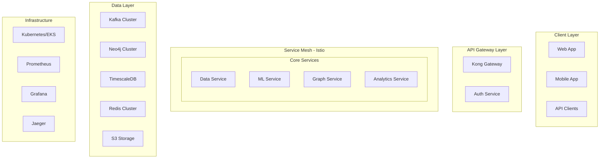

# RiskRadar Phase 2 - Technical Requirements Document

> **Version**: 1.0  
> **Date**: 2025-07-19  
> **Status**: Planning

## 📋 Executive Summary

Phase 2 focuses on transforming our proven MVP into a production-ready, enterprise-grade platform. Key technical initiatives include achieving 80%+ ML accuracy, implementing Kubernetes orchestration, building multi-tenant architecture, and establishing advanced analytics capabilities.

## 🎯 Technical Objectives

### Core Goals
1. **ML Performance**: Achieve F1-Score ≥ 80% for Korean NER
2. **Cloud Native**: Full Kubernetes migration with auto-scaling
3. **Enterprise Ready**: Multi-tenancy, RBAC, audit logging
4. **Advanced Analytics**: Predictive models, time-series analysis
5. **Production SLA**: 99.5% uptime, <100ms API response

### Architecture Evolution
```
Phase 1 (Current)              →    Phase 2 (Target)
├── Docker Compose             →    ├── Kubernetes (EKS)
├── Single Region              →    ├── Multi-Region Ready
├── Basic Monitoring           →    ├── Full Observability
├── Manual Scaling             →    ├── Auto-scaling
└── Monolithic Services        →    └── Microservices + Mesh
```

## 🏗️ Technical Architecture

### System Architecture


### Deployment Architecture
```yaml
Production Environment:
  Regions:
    Primary: ap-northeast-2 (Seoul)
    DR: ap-northeast-1 (Tokyo)
  
  Kubernetes:
    Clusters: 2 (Primary + DR)
    Nodes: 10-50 (auto-scaling)
    Resources:
      - CPU: 200-1000 cores
      - Memory: 400GB-2TB
      - Storage: 10TB-50TB
  
  Data Stores:
    Neo4j: 5 nodes (3 core + 2 read)
    Kafka: 5 brokers
    Redis: 3 nodes (1 master + 2 replicas)
    TimescaleDB: 3 nodes (1 primary + 2 standby)
```

## 📊 Technical Requirements by Component

### 1. ML Service Enhancement

#### Requirements
- **Model Performance**
  - F1-Score: ≥ 80% (current: 56.3%)
  - Inference time: < 5ms (current: 2.57ms) ✓
  - Throughput: > 500 docs/sec (current: 389) 
  - GPU support for training

- **Model Architecture**
  ```python
  class EnhancedNERPipeline:
      models = {
          'primary': 'klue/bert-base',
          'fallback': 'ko-electra',
          'domain': 'custom-finance-bert'
      }
      
      features = {
          'ensemble': True,
          'active_learning': True,
          'explainability': True,
          'a_b_testing': True
      }
  ```

- **Training Pipeline**
  - Automated retraining with new data
  - A/B testing framework
  - Model versioning with DVC
  - Performance monitoring dashboard

#### Technical Implementation
```yaml
ml-service:
  deployment:
    replicas: 3-10 (HPA)
    resources:
      cpu: 2-4 cores
      memory: 8-16GB
      gpu: Optional (T4 for training)
    
  features:
    - Domain-specific BERT fine-tuning
    - Online learning capabilities
    - Model interpretation API
    - Batch prediction endpoint
    
  monitoring:
    - Model drift detection
    - Feature importance tracking
    - Prediction confidence distribution
```

### 2. Data Service Scaling

#### Requirements
- **Data Sources**: 15+ (current: 7)
- **Processing**: 2,500+ articles/hour
- **Latency**: < 2 minutes (current: 2-3 min)
- **Storage**: Distributed with S3

#### Architecture
```python
class ScalableDataPipeline:
    components = {
        'scheduler': 'Airflow',
        'workers': 'Celery',
        'queue': 'RabbitMQ',
        'storage': 'S3 + Glacier'
    }
    
    features = {
        'distributed_crawling': True,
        'smart_scheduling': True,
        'quality_scoring': True,
        'auto_retry': True
    }
```

### 3. Graph Service Evolution

#### Requirements
- **Query Performance**
  - 1-hop: < 20ms (current: 15ms) ✓
  - 3-hop: < 100ms (current: 145ms) 
  - Write TPS: > 500 (current: 150)
  
- **Advanced Features**
  - Time-series graph analysis
  - Graph ML algorithms
  - Real-time graph updates
  - Multi-tenant isolation

#### Implementation
```cypher
// Time-series relationship example
CREATE (c1:Company)-[r:SUPPLIED_TO {
    start_date: datetime('2024-01-01'),
    end_date: datetime('2024-12-31'),
    volume: 1000000,
    risk_scores: [0.3, 0.4, 0.5, 0.4]
}]->(c2:Company)

// Graph algorithm integration
CALL gds.pageRank.stream('company-network')
YIELD nodeId, score
RETURN gds.util.asNode(nodeId).name AS company, score
ORDER BY score DESC
```

### 4. Platform Services

#### API Gateway (Kong)
```yaml
kong:
  plugins:
    - rate-limiting:
        minute: 1000
        hour: 10000
    - jwt-auth:
        key_claim_name: kid
        secret_is_base64: true
    - request-transformer:
        add_headers:
          - X-Tenant-ID:{{tenant_id}}
    - prometheus:
        metrics: true
```

#### Service Mesh (Istio)
```yaml
istio:
  features:
    - Traffic management
    - Security policies
    - Observability
    - Canary deployments
  
  policies:
    - mTLS between services
    - Circuit breakers
    - Retry policies
    - Fault injection
```

### 5. Multi-Tenant Architecture

#### Design Principles
1. **Data Isolation**: Separate schemas/databases per tenant
2. **Resource Quotas**: CPU/memory limits per tenant
3. **Performance Isolation**: Dedicated worker pools
4. **Security**: Row-level security in shared resources

#### Implementation
```python
class TenantManager:
    def __init__(self):
        self.tenant_configs = {}
        self.resource_quotas = {}
    
    def get_tenant_context(self, tenant_id: str):
        return TenantContext(
            db_schema=f"tenant_{tenant_id}",
            kafka_prefix=f"{tenant_id}_",
            neo4j_database=f"tenant_{tenant_id}",
            resource_limits=self.resource_quotas[tenant_id]
        )
```

## 🔧 Infrastructure Requirements

### Kubernetes Configuration
```yaml
# Production Cluster Requirements
cluster:
  version: "1.28+"
  nodes:
    - name: system
      count: 3
      instance: t3.large
    - name: services  
      count: 5-20
      instance: c5.2xlarge
      autoscaling: true
    - name: ml
      count: 2-5
      instance: g4dn.xlarge
      gpu: true
    - name: data
      count: 3-10
      instance: m5.2xlarge
      storage: 1TB
```

### Monitoring Stack
```yaml
monitoring:
  metrics:
    - Prometheus + Thanos
    - Custom business metrics
    - SLO/SLI dashboards
  
  logging:
    - EFK stack (Elasticsearch, Fluentd, Kibana)
    - Structured logging
    - Log retention: 30 days
  
  tracing:
    - Jaeger for distributed tracing
    - Service dependency mapping
    - Performance bottleneck analysis
  
  alerting:
    - PagerDuty integration
    - Slack notifications
    - Escalation policies
```

### Security Requirements
```yaml
security:
  network:
    - VPC with private subnets
    - WAF for API protection
    - DDoS protection
  
  data:
    - Encryption at rest (AES-256)
    - Encryption in transit (TLS 1.3)
    - Key management (AWS KMS)
  
  access:
    - RBAC with OIDC
    - MFA enforcement
    - Audit logging
  
  compliance:
    - GDPR compliance tools
    - Data retention policies
    - Right to deletion
```

## 📈 Performance Requirements

### Service Level Objectives (SLOs)

| Service | Availability | Latency (p95) | Throughput |
|---------|--------------|---------------|------------|
| API Gateway | 99.9% | < 50ms | 10K RPS |
| Data Service | 99.5% | < 2 min | 2.5K articles/hr |
| ML Service | 99.5% | < 5ms | 500 docs/sec |
| Graph Service | 99.5% | < 100ms | 500 TPS |

### Scalability Requirements
- Support 1,000 concurrent users
- Handle 100,000 monitored companies
- Process 50,000 articles/day
- Store 1TB+ graph data
- 10TB+ time-series data

## 🔄 Migration Strategy

### Phase 2A: Foundation (Week 5)
1. Set up EKS clusters
2. Implement service mesh
3. Deploy monitoring stack
4. Migrate stateless services

### Phase 2B: Data Layer (Week 6)
1. Migrate Kafka to MSK
2. Set up managed Neo4j
3. Implement TimescaleDB
4. Configure backup strategies

### Phase 2C: Application Layer (Week 7)
1. Deploy multi-tenant services
2. Implement new ML models
3. Enable advanced analytics
4. Set up API gateway

### Phase 2D: Cutover (Week 8)
1. Data migration
2. Traffic switching
3. Legacy shutdown
4. Performance validation

## 🧪 Testing Requirements

### Test Categories
1. **Unit Tests**: >80% coverage
2. **Integration Tests**: All service interactions
3. **Performance Tests**: Load, stress, endurance
4. **Security Tests**: Penetration, vulnerability
5. **Chaos Engineering**: Failure injection

### Test Automation
```yaml
ci-cd:
  pipeline:
    - Unit tests on commit
    - Integration tests on PR
    - Performance tests nightly
    - Security scans weekly
    - Chaos tests monthly
  
  tools:
    - GitHub Actions
    - ArgoCD for GitOps
    - Chaos Mesh
    - OWASP ZAP
```

## 📊 Success Metrics

### Technical KPIs
- ML F1-Score: ≥ 80%
- System uptime: ≥ 99.5%
- API latency: < 100ms (p95)
- Zero security incidents
- 100% test automation

### Operational KPIs
- Deployment frequency: Daily
- Lead time: < 2 hours
- MTTR: < 30 minutes
- Change failure rate: < 5%
- Resource utilization: > 70%

## 🚨 Technical Risks

| Risk | Impact | Mitigation |
|------|--------|------------|
| ML model overfitting | High | Cross-validation, ensemble methods |
| Kubernetes complexity | Medium | Training, managed services |
| Data migration issues | High | Incremental migration, rollback plan |
| Multi-tenant bugs | High | Extensive testing, gradual rollout |

## 📅 Technical Roadmap

### Sprint 2 Technical Deliverables (Weeks 5-6)
- KLUE-BERT fine-tuning pipeline
- Kubernetes cluster setup
- Service mesh implementation
- Advanced monitoring deployment
- 10+ new data sources

### Sprint 3 Technical Deliverables (Weeks 7-8)
- Multi-tenant architecture
- RBAC implementation
- Advanced analytics APIs
- Production migration
- Security hardening

---

**Document History**
- v1.0 (2025-07-19): Initial Phase 2 TRD based on Phase 1 outcomes